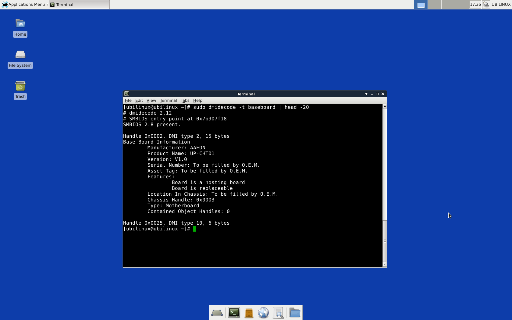

Run a simple C sample on the UP-board running ubilinux 3.0
===
---

# Table of Contents

-   [Introduction](#Introduction)
-   [Step 1: Prerequisites](#Step-1-Prerequisites)
-   [Step 2: Prepare your Device](#Step-2-PrepareDevice)
-   [Step 3: Build and Run the Sample](#Step-3-Build)
-   [Tips](#tips)

<a name="Introduction"></a>
# Introduction

**About this document**

This document describes the process of setting up an
[UP-board](http://www.up-board.org/) device to connect to an Azure IoT hub.
This multi-step process includes:
-   Configuring Azure IoT Hub
-   Registering your IoT device
-   Build and deploy Azure IoT SDK on the UP-board

<a name="Step-1-Prerequisites"></a>
# Step 1: Prerequisites

You should have the following items ready before beginning the process:
-   [UP-board](http://up-shop.org/) with access to the [azure-iot-sdks](https://github.com/Azure/azure-iot-sdks) GitHub public repository.
-   USB keyboard
-   USB mouse
-   HDMI cable
-   TV/ Monitor that supports HDMI
-   Ethernet cable or Wi-Fi dongle
-   [Prepare your development environment][setup-devbox-linux]
-   [Setup your IoT hub][lnk-setup-iot-hub]
-   [Provision your device and get its credentials][lnk-manage-iot-hub]

<a name="Step-2-PrepareDevice"></a>
# Step 2: Prepare your Device

-   Download the latest version of ubilinux 3.0 following this [link](http://www.up-community.org/downloads)
-   Install ubilinx 3.0 by following the [Getting started guide](http://www.up-community.org/UpWiki/index.php/Getting_Started)
-   Login to your system using user **ubilinux** and same password and open a terminal.

  


<a name="Step-3-Build"></a>
# Step 3: Build and Run the sample

Run the following commands in the terminal.

-   Download the Azure IoT device SDK:

    ```
    git clone --recursive https://github.com/Azure/azure-iot-sdks.git
    ```

-   Confirm that you now have a copy of the SDK under the directory ./azure-iot-sdks. Then cd to the directory:

    ```
    cd azure-iot-sdks
    ```

-   Prepare your environment by running. Answer **y** when you are prompted to install the additional components needed to run the samples:
    ```
    sudo c/build_all/linux/setup.sh
    ```

-   Edit the file ./c/iothub_client/samples/iothub_client_sample_http/iothub_client_sample_http.c and replace connection string placeholder with the connection string
you obtained in the [step](#DeviceConnectionString) above.
(You can use the console-based text editor **vim** to edit the file):

    ```
    static const char* connectionString = "[device connection string]";
    ```
    > Note: You can skip this step if you only want to build the samples without running them.

-   Finally, build the SDK and sample applications:

    ```
    ./c/build_all/linux/build.sh
    ```

<a name="buildsimplesample"/>
## Run the IoT Hub Client Sample HTTP sample application

-   Run the **iothub_client_sample_http** sample:

    ```
	sudo ~/cmake/iothub_client/samples/iothub_client_sample_http/iothub_client_sample_http
    ```

This sample application sends simulated sensor data to your IoT Hub.

-   See [Manage IoT Hub][lnk-manage-iot-hub] to learn how to observe the messages IoT Hub receives from the application.
-   See [Manage IoT Hub][lnk-manage-iot-hub] to learn how to send cloud-to-device messages to the application.

[setup-devbox-linux]: https://github.com/Azure/azure-iot-sdks/blob/master/c/doc/devbox_setup.md
[lnk-setup-iot-hub]: ../setup_iothub.md
[lnk-manage-iot-hub]: ../manage_iot_hub.md
