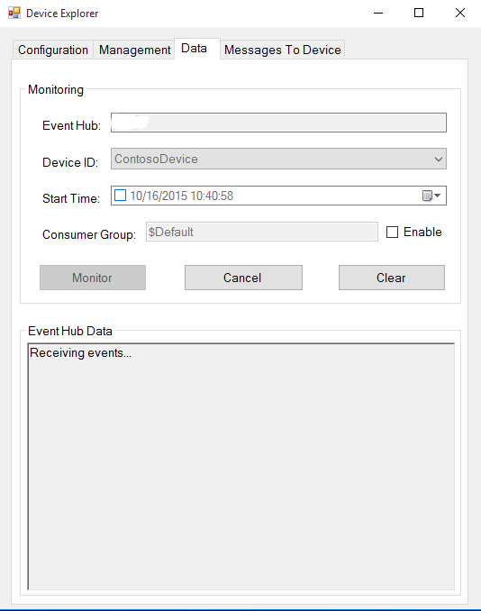
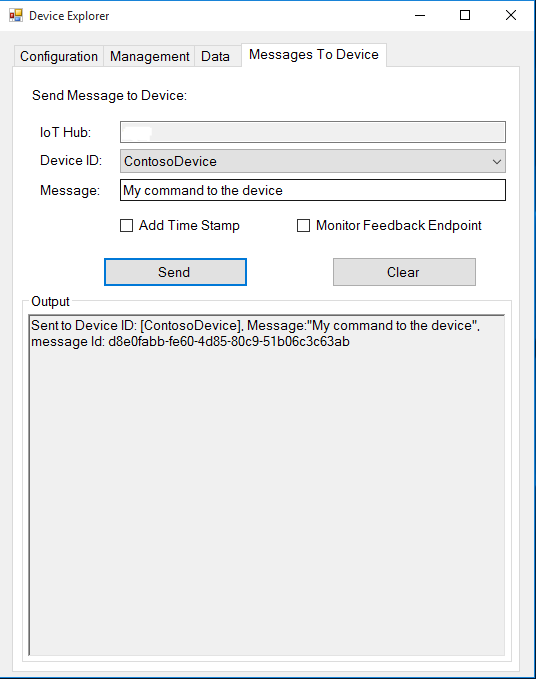

How to certify IoT devices on Non-Supported Platforms with Azure IoT SDK
===
---

# Table of Contents

-   [Introduction](#Introduction)
-   [Step 1: Sign Up To Azure IoT Hub](#Step_1)
-   [Step 2: Register Device](#Step_2)
-   [Step 3: Build and Validate the sample using C client libraries](#Step_3)
    -   [3.1 Port the C Libraries to Other Platforms](#Step_3_1)
    -   [3.2 Run and Validate the Samples](#Step_3_2)
-   [Step 4: Package and Share](#Step_4)
    -   [4.1 Package build logs and sample test results](#Step_4_1)
    -   [4.2 Share with the Azure IoT Certification team](#Step_4_2)
    -   [4.3 Next steps](#Step_4_3)
-   [Step 5: Troubleshooting](#Step_5)

<a name="Introduction"/>
# Introduction

**About this document**

This document provides step by step guidance to IoT hardware publishers on how to certify an IoT enabled hardware with Azure IoT C SDK. This multi-step process
includes: 
-   Configuring Azure IoT Hub 
-   Registering your IoT device
-   Build and deploy Azure IoT SDK on device
-   Packaging and sharing the logs

**Prepare**

Before executing any of the steps below, read through each process, step by step to ensure end to end understanding.

You should have the following items ready before beginning the process:

-   Computer with GitHub installed and access to the
    [azure-iot-sdks](https://github.com/Azure/azure-iot-sdks) GitHub public repository.
-   SSH client, such as [PuTTY](http://www.putty.org/), so you can access the
    command line.
-   Required hardware to certify.

<a name="Step_1"/>
# Step 1: Sign Up To Azure IoT Hub

Follow the instructions [here](https://account.windowsazure.com/signup?offer=ms-azr-0044p) on how to sign up to the Azure IoT Hub service.

As part of the sign up process, you will receive the connection string. 

-   **IoT Hub Connection String**: An example of IoT Hub Connection String is as below:

         HostName=[YourIoTHubName];SharedAccessKeyName=[YourAccessKeyName];SharedAccessKey=[YourAccessKey]

<a name="Step_2"/>
# Step 2: Register Device

In this section, you will register your device using DeviceExplorer. The DeviceExplorer is a Windows application that interfaces with Azure IoT Hub and can perform the following operations:

-   Device management
    -   Create new devices
    -   List existing devices and expose device properties stored on Device Hub
    -   Provides ability to update device keys
    -   Provides ability to delete a device
-   Monitoring events from your device
-   Sending messages to your device

To run DeviceExplorer tool, use following configuration string as described in [Step1](#Step_1):

-   IoT Hub Connection String
    

**Steps:**
1.  Click [here](<https://github.com/Azure/azure-iot-sdks/blob/master/tools/DeviceExplorer/doc/how_to_use_device_explorer.md>) to download and install DeviceExplorer.

2.  Add connection information under the Configuration tab and click the **Update** button.

3.  Create and register the device with your IoT Hub using instructions as below.

    a. Click the **Management** tab.

    b. Your registered devices will be visible in the list. In case your device is not there in the list, click **Refresh** button. If this is your first time, then you shouldn't retrieve anything.

    c. Click **Create** button to create a device ID and key.

    d. Once created successfully, device will be listed in DeviceExplorer.

    e. Right click the device and from context menu select "**Copy connection
    string for selected device**".

    f. Save this information in Notepad. You will need this information in
    later steps.

***Not running Windows on your PC?*** - Please follow the instructions [here](<https://github.com/Azure/azure-iot-sdks/blob/master/doc/manage_iot_hub.md>) to provision your device and get its credentials.

<a name="Step_3"/>
# Step 3: Build and Validate the sample using C client libraries

<a name="Step_3_1"/>
## 3.1 Port the C Libraries to Other Platforms

Following document provide guidance on how to port the C Internet of Things (IoT) client library to platforms not supported out of the box. The document does cover the specifics of any particular platform.

<https://github.com/Azure/azure-iot-sdks/blob/master/c/doc/porting_guide.md>

<a name="Step_3_2"/>
## 3.2 Run and Validate the Samples

In this section you will run the Azure IoT client SDK samples to validate communication between your device and Azure IoT Hub. You will send messages to the Azure IoT Hub service and validate that IoT Hub has successfully receive the data. 

***Note:*** *Take screenshots of all the operations you will perform in this
section. These will be needed in [Step 4](#Step_4_2).*

<a name="Step_3_2_1"/>
### 3.2.1 Send Device Events to IoT Hub

1.  Launch the DeviceExplorer as explained in [Step 2](#Step_2) and navigate to **Data** tab. Select the device name you created from the drop-down list of device IDs and click **Monitor** button.

    

2.  DeviceExplorer is now monitoring data sent from the selected device to the IoT Hub.

3.  Use simple sample created after porting client libraries to send device events to IoT Hub.

<a name="Step_3_2_2"/>
### 3.2.2 Receive messages from IoT Hub

1.  To verify that you can send messages from the IoT Hub to your device,
    go to the **Messages to Device** tab in DeviceExplorer.

2.  Select the device you created using Device ID drop down.

3.  Add some text to the Notification field, then click Send.

    

4.  Use the sample you have created after porting client libraries to receive notification messages from IoT hub. You should be able to see the command received.

<a name="Step_4"/>
# Step 4: Package and Share

<a name="Step_4_1"/>
## 4.1 Package build logs and sample test results

Package the following artifacts from your device:

1.  Build logs and test results from your platform.

2.  All the screenshots that belong to "**Send Device Events to IoT Hub**" section.

3.  All the screenshots that belong to "**Receive messages from IoT Hub**" section.

4.  Create a document that explains how to run the sample with your hardware (explicitly highlighting the new steps for customers). As a guideline on how the instructions should look please refer the examples published on GitHub repository [here](<https://github.com/Azure/azure-iot-sdks/tree/master/doc/get_started>).

<a name="Step_4_2"/>
## 4.2 Share with the Azure IoT Certification team

Send the package in email to  <iotcert@microsoft.com>.

<a name="Step_4_3"/>
## 4.3 Next steps

Once you shared the documents with us, we will contact you in the following 48 to 72 business hours with next steps.

<a name="Step_5"/>
# Step 5: Troubleshooting

Please contact engineering support on <iotcert@microsoft.com> for help with troubleshooting.